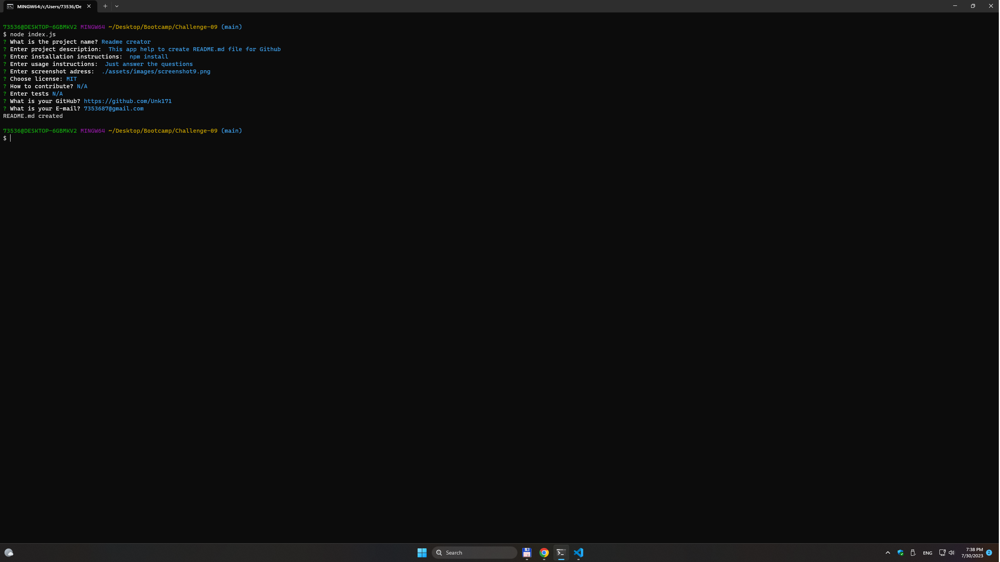

# Readme creator
  
  ## Description
  This app help to create README.md file for Github
  ## Table of Contents
- [Installation](#installation)
- [Usage](#usage)
- [Iicense](#Iicense)
- [How to contribute](#how-to-contribute)
- [Tests](#tests)
- [Questions](#questions)
## Installation
npm install
## Usage
Just answer the questions

  
## Iicense
MIT
## How to contribute
N/A
## Tests
N/A
## Questions
* Github: https://github.com/Unk171
* You can send your questions to my e-mail: 7353687@gmail.com
  